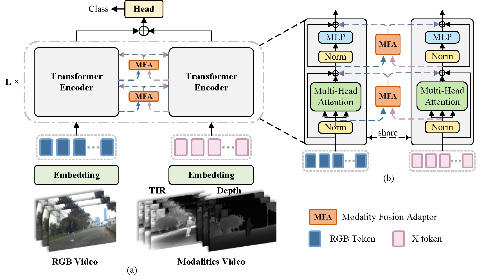

# MF-ViT
This is the official implementaion of paper Modality Fusion Adaptor-Enhanced Vision Transformer for Multimodal Action Recognition

<p align="center">
  
</p>

---

## Models
[Models](https://drive.google.com/drive/folders/1S58CZjuMa690-M-R5ar6UtDZSj6862UQ?usp=drive_link)

---

## Usage
### Installation
Create and activate a conda environment:
```
conda create -n mf-vit python=3.8
conda activate mf-vit
```
Install the required packages:
```
bash install.sh
```
---
### Data Preparation
Download the training datasets, It should look like:
```
$<PATH_of_Datasets>
    -- ICPR_MMVPR_Track3
        -- training_set
            |-- rgb_data
            |-- ir_data
            |-- depth_data
            |-- train_videofolder.txt
        -- test_set
            |-- rgb_data
            |-- ir_data
            |-- depth_data
            |-- test_videofolder.txt
```
---
### Path Setting
Run the following command to set paths:
```
python tools/create_default_local_file.py --workspace_dir . --data_dir <PATH_of_Datasets> --save_dir ./output
```
You can also modify paths by these one files:
```
./lib/train/admin/local.py  # paths for training
```
---
### Training
Download pre-trained  [VideoMAE](https://drive.google.com/file/d/1MzwteHH-1yuMnFb8vRBQDvngV1Zl-d3z/view) and put it under `$PROJECT_ROOT$/pretrained_models` (different pretrained models can also be used, see [VideMAE](https://github.com/MCG-NJU/VideoMAE/blob/main/MODEL_ZOO.md) for more details).
and put it under `$PROJECT_ROOT$/pretrained_models/`.
```
bash train_model.sh
```
---
### Testing

Put the downloaded weights on `$PROJECT_ROOT$/output/checkpoints/train/mf_vit`

After running, the system will generate a `submission.zip` file in the path `$PROJECT_ROOT$/submission/mf-vit/config_file_name/`.
Please ensure that the configuration file name is correct so that the resulting zip file contains the appropriate test results.
#### ICPR_MMVPR_Track3_test
- RGB-T
```
python tools/test.py --script mf_vit --config track3_rgbt_k400_ep10 --save_dir ./output
```
- RGB-D
```
python tools/test.py --script mf_vit --config track3_rgbd_k400_ep10 --save_dir ./output
```
- RTD
```
python tools/test.py --script mf_vit --config track3_rtd_k400_ep10 --save_dir ./output
```

---
## Acknowledgments
* Thanks for the [OSTrack](https://github.com/botaoye/OSTrack) and [VideoMAE](https://github.com/MCG-NJU/VideoMAE) library, which helps us to quickly implement our ideas.
* Thanks for the [PyTracking](https://github.com/visionml/pytracking) library.


